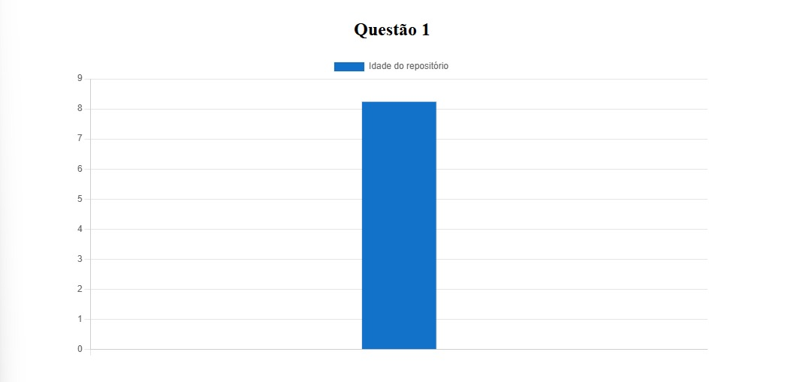
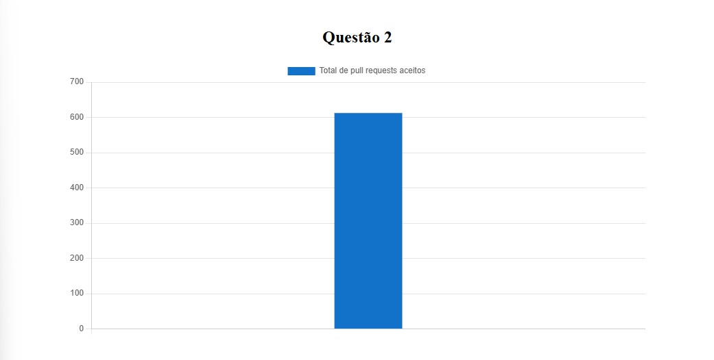
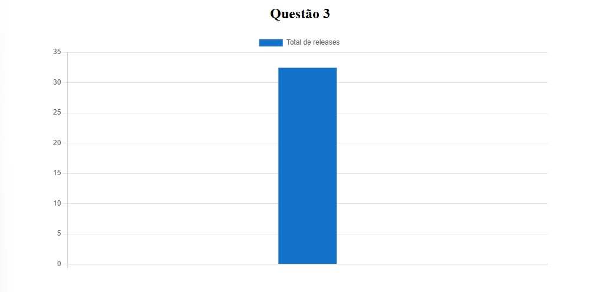
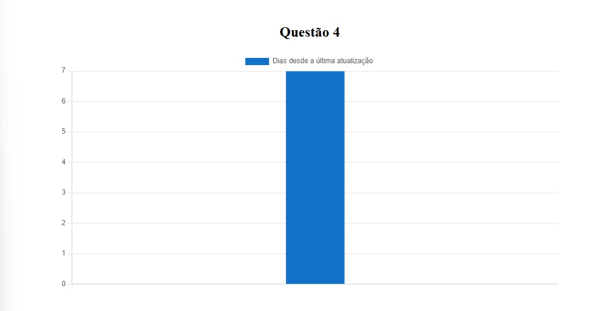
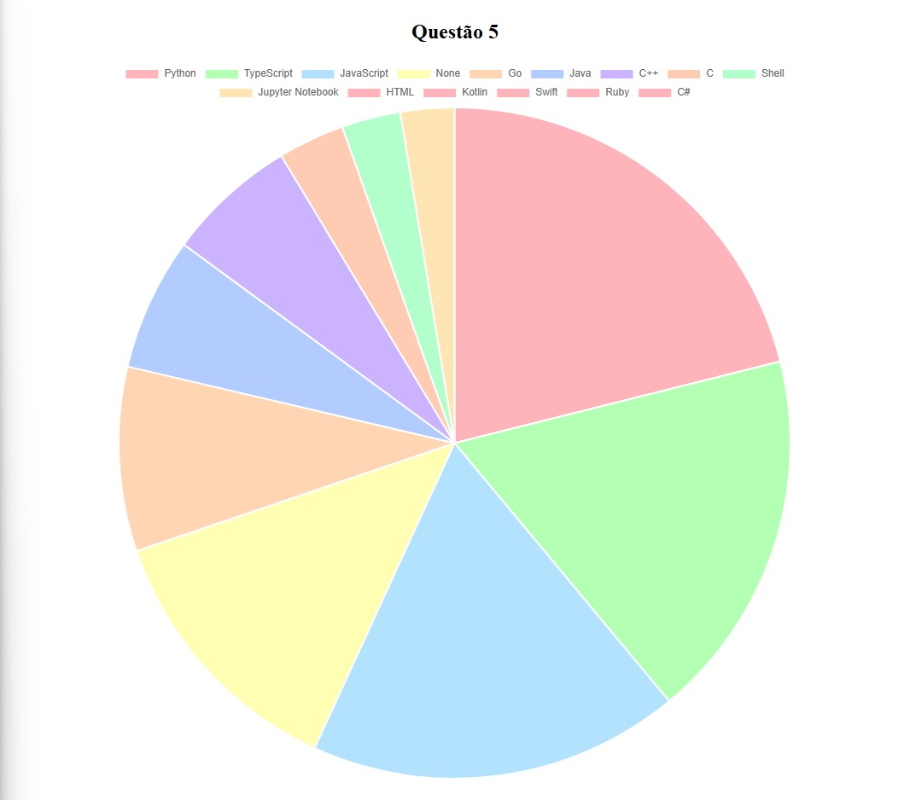
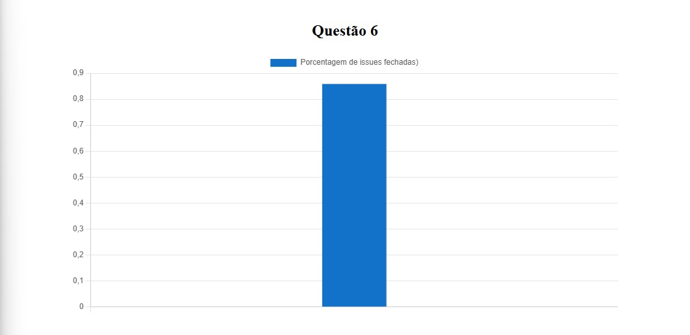

## Introdução

Este relatório tem como objetivo analisar características comuns entre sistemas populares no GitHub. Para isso, foram coletadas informações de repositórios amplamente conhecidos na plataforma, avaliando aspectos como idade, contribuições, releases, atualizações, linguagens utilizadas e gestão de issues.

A partir dessas informações, buscamos responder a seis perguntas de pesquisa (RQs) que investigam padrões recorrentes entre os sistemas mais bem avaliados e utilizados da comunidade de desenvolvimento de software.

## Metodologia

A análise foi realizada utilizando a API GraphQL do GitHub para coletar dados de repositórios populares. As métricas analisadas incluem:
- RQ1: Idade do repositório em dias
- RQ2: Total de pull requests aceitas
- RQ3: Total de releases do projeto
- RQ4: Tempo desde último commit
- RQ5: Principais linguagens dos repositórios
- RQ6: Razão entre o número de issues fehcadas pelo total de issues

## Hipóteses

### RQ 01: Sistemas populares são maduros/antigos?
Hipótese: Esperamos que sistemas populares sejam maduros.

### RQ 02: Sistemas populares recebem muita contribuição externa?
Hipótese: Acreditamos que sistemas populares recebem muitas contribuições.

### RQ 03: Sistemas populares lançam releases com frequência?
Hipótese: Suponhamos que frameworks e bibliotecas populares lancem releases frequentes.

### RQ 04: Sistemas populares são atualizados com frequência?
Hipótese: Achamos que sistemas populares são frequentemente atualizados para corrigir bugs e evoluir.

### RQ 05: Sistemas populares são escritos nas linguagens mais populares?
Hipótese: A tendência é que sim, especialmente com JavaScript e Python.

### RQ 06: Sistemas populares possuem um alto percentual de issues fechadas?
Hipótese: Supomos que sim, pois são bem gerenciados.

## Resultados Obtidos
### RQ 01
Mediana da idade dos repositórios  - 8.25

### RQ 02
Mediana de pull requests - 613.5

### RQ 03
Mediana de releases - 32.5

### RQ 04
Mediana do tempo desde última alteração - 7

### RQ 05
Python - 171
TypeScript - 145
JavaScript - 145
None - 105
Go - 72
Java - 52
C++ - 51
C - 26
Shell - 23
Jupyter Notebook - 21

### RQ 06
Mediana do ratio de issues: 0.86

## Discussão
### Análise RQ01
Com os dados coletados, podemos confirmar a nossa hipótese de que sistemas populares são maduros/antigos. Levando em consideração de que o github existe desde 2008 (informações obtidas da wikipedia), e que projetos profissionais fechados levam em média de 3 a 5 anos, pode-se considerar que projetos com mais de 8 anos, são considerados antigos. O investimento contínuo da comunidade nesses reposítórios extendem a vida ativa deles.

### Análise RQ02
Os dados coletados provam que nossa hipótese estava correta, entretanto, se levarmos em conta que o número de pull requests abertos, não significa que eles foram aceitos, pode ser que o número de contribuições (que não chegaram a ser efetivadas no projeto), seja ainda maior.

### Análise RQ03
Com uma mediana de 32.5 releases, pode-se confirmar a hipotese levantada de que sim, é frequentemente lançado versões novas para os projetos populares do github.

### Análise RQ04
Com os dados coletados podemos confirmar nossa hipotese de que sistemas populares são frequentemente atualizados. Infelizmente não foi possível filrar se o tipo de atualiação é para a correção de bugs, entretanto pode-se inferir que uma atualização a cada 7 dias dificilmente será apenas de evolutivas.

### Análise RQ05
Ao analisarmos os dados obtidos, fomos surpreendidos ao ver que javascript, empatou em uma das linguagens mais usadas com typescript. E foi possível confirmar que a linguagem mais usada foi Python, imaginamos que isso seja pela praticidade da sintaxe da lingua, compatibilidade e recursos disponibilizados para ela online.

### Análise RQ06
Os repositórios mais populares tem uma porcentagem alta de fechamento de issues, com uma mediana de 86%, provando nossa hipotése de que os repositórios são bem gerenciados, com a atenção e manutenção da comunidade.

## Referências bibliográficas
https://en.wikipedia.org/wiki/GitHub
